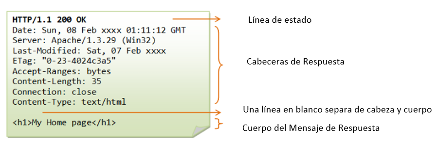
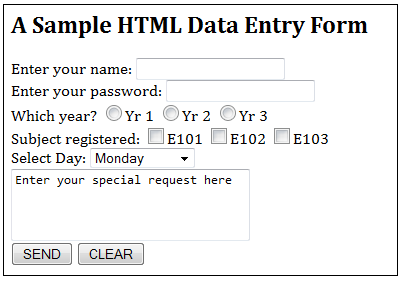
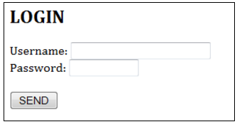
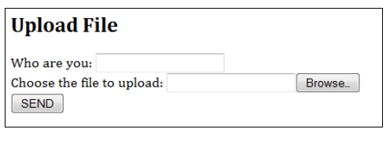

###HTTP (Protocolo de Tranferencia de Hipertexto)

###Bases Esenciales


**Introduccion**

**La WEB**

Internet (o la web) es un sistema de informacion cliente/servidor de distribucion masiva como se muestra en el siguiente diagrama.


Muchas aplicaciones se estan ejecutando al mismo tiempo a traves de Internet, tales como la navegacion en internet, correo electronico, transferencia de arhivos, transmision de audio y video(streaming). Para que una comunicacion adecuada tenga lugar entre el cliente y el servidor, estas aplicaciones deben estar de acuerdo con un protocolo especifico de nivel de aplicacion como HTTP, FTP, SMTP, POP y  etc.


**Protocolo de Transferencia de Hipertexto (HTTP)**

HTTP (Protocolo de Transferencia de Hipertexto) es quizas el protocolo de aplicacion mas popular en Internet (o en la web).
* HTTP es un protocolo cliente-servidor de petición-respuesta asimétrica como se ilustra. Un cliente HTTP envía un mensaje de petición a un servidor HTTP. El servidor, a su vez, devuelve un mensaje de respuesta. En otras palabras, HTTP es un protocolo de extracción, el cliente extrae la información desde el servidor (en lugar de servidor empuja información hasta el cliente).


* HTTP es un protocolo sin estado. En otras palabras, la solicitud actual no sabe lo que se ha hecho en las anteriores solicitudes.
* HTTP permite la negociación de tipo de datos y representación, a fin de permitir que los sistemas que se construyan de forma independiente de los datos que se transfieren.
* Citando el RFC2616: "El Protocolo de transferencia de hipertexto (HTTP) es un protocolo de nivel de aplicación para sistemas de información distribuidos de colaboración, hipermedia. Es un genérico sin estado, el protocolo, que se puede utilizar para muchas tareas más allá de su uso para el hipertexto, por ejemplo. como servidores de nombres y sistemas de gestión de objetos distribuidos, a través de la extensión de sus métodos de petición, códigos de error y los encabezados ".


**Navegador**

Cada vez que se emite una dirección URL de su navegador para obtener un recurso web a través de HTTP, por ejemplo, http://www.nowhere123.com/index.html, el navegador vuelve la dirección URL en un mensaje de solicitud y la envía al servidor HTTP. El servidor HTTP interpreta el mensaje de petición, y le devuelve un mensaje de respuesta apropiada, que puede ser el recurso que ha solicitado o un mensaje de error. Este proceso se ilustra a continuación:


**Localizador Uniforme de Recursos (URL)**

Un URL (Uniform Resource Locator) se utiliza para identificar de forma exclusiva un recurso a través de Internet. URL tiene la siguiente sintaxis:

protocol://hostname:port/path-and-file-name

Son 4 partes en una dirección URL:
1. Protocolo: El protocolo de nivel de aplicación utilizada por el cliente y el servidor, por ejemplo, HTTP, FTP y telnet.

2. Nombre de host: El nombre de dominio DNS (por ejemplo, www.nowhere123.com) o la dirección IP (por ejemplo, 192.128.1.2) del servidor.

3. Puerto: el número de puerto TCP que el servidor está a la escucha de peticiones entrantes de los clientes.

4. Ruta-y-file-name: El nombre y la ubicación del recurso solicitado, bajo el directorio base de documentos del servidor.

Por ejemplo, en la http://www.nowhere123.com/docs/index.html URL, el protocolo de comunicación es HTTP; el nombre de host es www.nowhere123.com. El número de puerto no se ha especificado en la URL, y adquiere el número predeterminado, que es el puerto TCP 80 para HTTP. La ruta y el nombre del archivo para el recurso que se encuentra es "/docs/index.html".

Otros ejemplos de URL son:

ftp://www.ftp.org/docs/test.txt 
mailto:user@test101.com 
news:soc.culture.Singapore 
telnet://www.nowhere123.com/ 


**Protocolo HTTP**

Como se ha mencionado, cada vez que se introduce una URL en el cuadro de dirección del navegador, el navegador traduce la dirección URL en un mensaje de solicitud de acuerdo con el protocolo especificado; y envía el mensaje de petición al servidor.

Por ejemplo, el navegador tradujo el URL http://www.nowhere123.com/doc/index.html en el siguiente mensaje de petición de:

GET /docs/index.html HTTP/1.1 
Host: www.nowhere123.com 
Accept: image/gif, image/jpeg, */* 
Accept-Language: en-us 
Accept-Encoding: gzip, deflate 
User-Agent: Mozilla/4.0 (compatible; MSIE 6.0; Windows NT 5.1) 
(blank line) 

Cuando este mensaje de solicitud llega al servidor, el servidor puede tomar cualquiera de estas acciones:

1. El servidor interpreta la petición recibida, los mapas de la solicitud en un archivo en el directorio de documentos del servidor, y devuelve el archivo solicitado al cliente.

2. El servidor interpreta la petición recibida, los mapas de la solicitud en un programa guardado en el servidor, ejecuta el programa, y devuelve la salida del programa al cliente.

3. La solicitud no puede ser satisfecha, el servidor devuelve un mensaje de error.

Un ejemplo del mensaje de respuesta HTTP es como se muestra:

HTTP/1.1 200 OK
Date: Sun, 18 Oct 2009 08:56:53 GMT
Server: Apache/2.2.14 (Win32)
Last-Modified: Sat, 20 Nov 2004 07:16:26 GMT
ETag: "10000000565a5-2c-3e94b66c2e680"
Accept-Ranges: bytes 
Content-Length: 44
Connection: close
Content-Type: text/html
X-Pad: avoid browser bug

```html
<html><body><h1>It works!</h1></body></html>
```

El navegador recibe el mensaje de respuesta, interpreta el mensaje y muestra el contenido del mensaje en la ventana del navegador de acuerdo con el tipo de medio de la respuesta (como en la cabecera de respuesta Content-Type). Tipo de medios comunes incluyen "text / plain", "text / html", "image / gif", "image / jpeg", "audio / mpeg", "video / mpeg", "aplicación / pdf" y "application / pdf ".

En su estado de reposo, un servidor HTTP no hace más que escuchar a la dirección (es) IP y el puerto (s) especificado en la configuración de solicitud entrante. Cuando llega una petición, el servidor analiza el encabezado del mensaje, aplica las reglas especificadas en la configuración, y toma la acción apropiada. El Control principal del webmaster sobre la acción del servidor web es a través de la configuración.


**HTTP a través de TCP / IP**

HTTP es un protocolo de nivel de aplicación cliente-servidor. Por lo general se ejecuta sobre una conexión TCP / IP, como se ilustra. (HTTP necesita no se ejecutan en TCP / IP. Sólo se presupone un transporte fiable. Cualquier protocolo de transporte que ofrecen tales garantías pueden ser utilizados.


TCP / IP (Transmission Control Protocol / Internet Protocol) es un conjunto de protocolos de transporte y la capa de red de las máquinas se comuniquen entre sí a través de la red.

IP (Internet Protocol) es un protocolo de capa de red, se ocupa de direccionamiento de red y enrutamiento. En una red IP, cada máquina se asigna una dirección IP única (por ejemplo, 165.1.2.3), y el software de IP es responsable de encaminar un mensaje desde la fuente de IP a la dirección IP de destino. En IPv4 (versión 4 de IP), la dirección IP se compone de 4 bytes, cada uno de los rangos de 0 a 255, separados por puntos, que se llama una forma de cuatro puntos. Este esquema de numeración soporta hasta 4G electrónico de la red. La última IPv6 (IP versión 6) soporta más direcciones. Desde memorizar el número es difícil para la mayoría de las personas, un nombre de dominio Inglés-como, como www.nowhere123.com se utiliza en su lugar. El DNS (Domain Name Service) traduce el nombre de dominio a la dirección IP (a través de tablas de búsqueda distribuidos). Una dirección IP 127.0.0.1 especial siempre se refiere a su propia máquina. Su nombre domian es "localhost" y puede ser utilizado para la prueba de bucle local.

TCP (Protocolo de control de transmisión) es un protocolo de capa de transporte, responsable de establecer una conexión entre dos máquinas. TCP consta de 2 protocolos: TCP y UDP (Datagrama de paquete de usuarios). TCP es fiable, cada paquete tiene un número de secuencia, y se espera un acuse de recibo. Un paquete será retransmitido si no es recibida por el receptor. la entrega de paquetes está garantizada en TCP. UDP no garantiza la entrega de paquetes, y por lo tanto no es fiable. Sin embargo, UDP tiene menos sobrecarga de la red y se puede utilizar para aplicaciones tales como vídeo y audio streaming, donde la fiabilidad no es crítica.

TCP multiplexa aplicaciones dentro de una máquina IP. Para cada máquina de IP, TCP soportes (multiplexa) de hasta 65.536 puertos (o enchufes), desde el puerto número entre 0 y 65535. Una de aplicación, tales como HTTP o FTP, se ejecuta (o escucha) en un número determinado puerto para las solicitudes entrantes. Puerto 0 a 1023 son pre-asignado a los protocolos populares, por ejemplo, HTTP a 80, a los 21 FTP, Telnet a 23, a 25 SMTP, NNTP en el 119, y el DNS a los 53 años el puerto 1024 y superiores están disponibles para los usuarios.

A pesar de que el puerto TCP 80 es pre-asignado a HTTP, como el número de puerto HTTP predeterminado, esto no significa que prohíbe la ejecución de un servidor HTTP en otro número de puerto asignado por el usuario (1024-65535), tales como 8000, 8080, especialmente para servidor de prueba. También puede ejecutar varios servidores HTTP en la misma máquina en diferentes números de puerto. Cuando un cliente envía una URL sin indicar explícitamente el número de puerto, por ejemplo, http://www.nowhere123.com/docs/index.html, el navegador se conectará con el número de puerto por defecto 80 de la acogida www.nowhere123.com. Es necesario especificar el número del puerto en la URL, por ejemplo, http://www.nowhere123.com:8000/docs/index.html si el servidor está escuchando en el puerto 8000 y no el puerto por defecto 80.

En resumen, para comunicarse a través de TCP / IP, lo que necesita saber (a) la dirección IP o el nombre de host, (b) Número de puerto.


**Especificaciones HTTP**

La especificación HTTP se mantiene por el W3C (Consorcio Mundial Web) y disponible en http://www.w3.org/standards/techs/http. Actualmente hay dos versiones de HTTP, es decir, HTTP / 1.0 y HTTP / 1.1. La versión original, HTTP / 0.9 (1991), escrito por Tim Berners-Lee, es un protocolo simple de transferencia de datos en bruto a través de Internet. HTTP / 1.0 (1996) (definido en RFC 1945), ha mejorado el protocolo permitiendo mensajes MIME-como. HTTP / 1.0 no se ocupa de los problemas de servidores proxy, almacenamiento en caché de conexión persistente, hosts virtuales, y el rango de descarga. Estas características se proporcionan en HTTP / 1.1 (1999) (definido en RFC 2616).

**Apache HTTP Server o Apache Tomcat**

Se necesita un servidor HTTP (como Apache HTTP org servidor Apache Tomcat Server) para estudiar el protocolo HTTP.

Servidor HTTP Apache es un servidor de producción industrial-fuerza popular, producida por Apache Software Foundation (ASF) @ www.apache.org. ASF es una base de software de código abierto. Es decir, el servidor Apache HTTP es libre, con el código fuente.

El primer servidor HTTP está escrito por Tim Berners Lee en el CERN (Centro Europeo de Investigación Nuclear) en Ginebra, Suiza, que también inventó HTML. Apache fue construido en NCSA (National Center for Supercomputing Applications, EE.UU.) "httpd 1.3" servidor, a principios de 1995. Apache probablemente recibe su nombre del hecho de que consiste en un código original (desde un servidor web httpd anterior NCSA) además de algunos parches; o del nombre de una tribu india americana.


**Solicitud HTTP y Mensajes de respuesta**

Cliente HTTP y el servidor se comunican mediante el envío de mensajes de texto. El cliente envía un mensaje de petición al servidor. El servidor, a su vez, devuelve un mensaje de respuesta.

El formato de un mensaje de petición HTTP consta de una cabecera de mensaje y un cuerpo de mensaje opcional, separados por una línea en blanco, como se ilustra a continuación:


**HTTP mensaje de solicitud**
El formato de un mensaje de petición HTTP es como sigue:


**Request Line**

La primera línea de la cabecera se llama la línea de solicitud, seguido de las cabeceras de solicitud opcionales.

La línea de solicitud tiene la siguiente sintaxis:

request-method-name request-URI HTTP-version
* Solicitud-nombre-método: protocolo HTTP define un conjunto de métodos de petición, por ejemplo, GET, POST, HEAD, y OPCIONES. El cliente puede utilizar uno de estos métodos para enviar una petición al servidor.
* URL de solicitud: especifica el recurso solicitado.
* HTTP-version: Dos versiones están actualmente en uso: HTTP / 1.0 y HTTP / 1.1.

Ejemplos de línea de solicitud son:

GET /test.html HTTP/1.1
HEAD /query.html HTTP/1.0
POST /index.html HTTP/1.1


**Cabeceras de Petición**

Los encabezados de solicitud están en la forma del nombre: pares de valores. Los valores múltiples, separados por comas, se pueden especificar.

request-header-name: request-header-value1, request-header-value2, ...

Los ejemplos de los encabezados de solicitud son:
Host: www.xyz.com
Connection: Keep-Alive
Accept: image/gif, image/jpeg, */*
Accept-Language: us-en, fr, cn


**Ejemplo**

A continuación se muestra un mensaje de petición HTTP de ejemplo:


**Mensaje de respuesta HTTP**

El formato del mensaje de respuesta HTTP es como sigue:


**Línea de estado**

La primera línea se llama la línea de estado, seguido de cabeceras de respuesta opcional).
La línea de estado tiene la siguiente sintaxis:

* HTTP-version status-code reason-phrase

* HTTP versión: La versión de HTTP utilizada en esta sesión. HTTP / 1.0 y HTTP / 1.1.
Código de estado: un número de 3 dígitos generado por el servidor para reflejar el resultado de la solicitud.

* Razón Frase: da una breve explicación para el código de estado.

* Código de estado común y la razón frase son "200 OK", "404 Not Found", "403 Prohibido", "500 Internal Server Error".

Los ejemplos de línea de estado son:

HTTP/1.1 200 OK
HTTP/1.0 404 Not Found
HTTP/1.1 403 Forbidden


**Encabezados de Respuesta**

Las cabeceras de respuesta están en la forma nombre: pares de valores:

response-header-name: response-header-value1, response-header-value2, ... 

Los ejemplos de cabeceras de respuesta son:

Content-Type: text/html
Content-Length: 35
Connection: Keep-Alive
Keep-Alive: timeout=15, max=100 

El cuerpo del mensaje de respuesta contiene los datos de los recursos solicitados.


**Ejemplo**
La imagen muestra la respuesta de la solicitud:




**HTTP Request Métodos**

El protocolo HTTP define un conjunto de métodos de petición. Un cliente puede utilizar uno de estos métodos de petición para enviar un mensaje de petición a un servidor HTTP. Los métodos son:

* GET: Un cliente puede utilizar la solicitud GET para obtener un recurso web desde el servidor.

* CABEZA: Un cliente puede utilizar la petición HEAD para obtener el encabezado que una petición GET habría obtenido. Desde el encabezado contiene la fecha de última modificación de los datos, esto se puede utilizar para comprobar contra la copia caché local.

* POST: Se utiliza para enviar los datos al servidor web.

* PUESTO: Pregunta el servidor para almacenar los datos.

* TRACE: Pregunta el servidor para devolver un rastreo de diagnóstico de las medidas que adopta.

* OPCIONES: Pregunta al servidor para devolver la lista de métodos de petición que apoya.

* CONNECT: Se utiliza para decirle a un proxy para establecer una conexión con otro host y sólo debe responder el contenido, sin intentar analizar o almacenar en caché. Esto a menudo se utiliza para hacer la conexión SSL a través del proxy. 

* Otros métodos de extensión.


**"GET" Método de solicitud**

GET es el método más común de solicitud HTTP. Un cliente puede utilizar el método GET para solicitar (o "get"), para una pieza de recursos desde un servidor HTTP. Un mensaje de petición GET toma la siguiente sintaxis:

GET request-URI HTTP-version
(optional request headers)
(blank line)
(optional request body)

* La palabra clave en este caso es GET y debe estar en mayúsculas.

* URL de solicitud: especifica la ruta del recurso solicitado, la cual debe empezar desde la raíz "/" del directorio de la base de documentos.

* HTTP-version: HTTP / 1.0 o HTTP / 1.1. Este cliente negocia el protocolo a utilizar para la sesión actual. Por ejemplo, el cliente puede solicitar el uso de HTTP / 1.1. Si el servidor no soporta el protocolo HTTP / 1.1, puede informar al cliente en la respuesta a utilizar HTTP / 1.0.

* El cliente utiliza los encabezados de solicitud opcionales (tales como Accept, Accept-Language, y etc) para negociar con el servidor y pedir al servidor para entregar los contenidos preferidos (por ejemplo, en el idioma que el cliente prefiere).

* GET mensaje de solicitud tiene un cuerpo de solicitud opcional que contiene la cadena de consulta (que se explica más adelante).


**Las solicitudes HTTP de pruebas**

Hay muchas maneras de poner a prueba las peticiones HTTP. Se puede utilizar el programa de utilidad como "telnet" o "Hyperterm" (búsqueda de "telnet.exe" o "hypertrm.exe" en c: \ windows), o escribir el propietario programa de la red para enviar mensaje de solicitud de prima a un servidor HTTP para poner a prueba las diversas peticiones HTTP.


**Telnet**

"Telnet" es una utilidad muy útil la creación de redes. Puede utilizar telnet para establecer una conexión TCP con un servidor; y emitir solicitudes HTTP primas. Por ejemplo, suponga que ha comenzado su servidor HTTP en la máquina local (la dirección IP 127.0.0.1) en el puerto 8000:

> telnet
telnet> help
... telnet help menu ...
telnet> open 127.0.0.1 8000
Connecting To 127.0.0.1...
GET /index.html HTTP/1.0
(Hit enter twice to send the terminating blank line ...)
... HTTP response message ...

Telnet es un protocolo basado en caracteres. Cada caracter se introduce en el cliente telnet se enviará inmediatamente al servidor. Por lo tanto, no se puede hacer error error tipográfico en entrar te mando prima, como borrar y la tecla de retroceso se envía al servidor. Puede que tenga que activar la opción de "eco local" para ver los caracteres que ingresa. Consulte el manual de telnet (ayuda de búsqueda de Windows ') para obtener más información sobre el uso de telnet.


**Programa de la red**

También puede escribir su propio programa de red para emitir petición HTTP prima a un servidor HTTP. Tu programa de la red deberá establecer primero una conexión TCP / IP con el servidor. Una vez establecida la conexión TCP, puede emitir la solicitud de prima.

Un ejemplo de programa de la red está escrito en Java es como se muestra (suponiendo que el servidor HTTP se ejecuta en el localhost 127.0.0.1 dirección (IP) en el puerto 8000):
import java.net.*;
import java.io.*;
   
public class HttpClient {
   public static void main(String[] args) throws IOException {
      // The host and port to be connected.
      String host = "127.0.0.1";
      int port = 8000;
      // Create a TCP socket and connect to the host:port.
      Socket socket = new Socket(host, port);
      // Create the input and output streams for the network socket.
      BufferedReader in
         = new BufferedReader(
              new InputStreamReader(socket.getInputStream()));
      PrintWriter out
         = new PrintWriter(socket.getOutputStream(), true);
      // Send request to the HTTP server.
      out.println("GET /index.html HTTP/1.0");
      out.println();   // blank line separating header & body
      out.flush();
      // Read the response and display on console.
      String line;
      // readLine() returns null if server close the network socket.
      while((line = in.readLine()) != null) {
         System.out.println(line);
      }
      // Close the I/O streams.
      in.close();
      out.close();
   }
}


**Solicitud HTTP / 1.0 GET**

A continuación se muestra la respuesta de una petición HTTP / 1.0 GET (tema a través de telnet o en su propio programa de la red - suponiendo que haya comenzado su servidor HTTP):

GET /index.html HTTP/1.0
(enter twice to create a blank line)

HTTP/1.1 200 OK
Date: Sun, 18 Oct 2009 08:56:53 GMT
Server: Apache/2.2.14 (Win32)
Last-Modified: Sat, 20 Nov 2004 07:16:26 GMT
ETag: "10000000565a5-2c-3e94b66c2e680"
Accept-Ranges: bytes
Content-Length: 44
Connection: close
Content-Type: text/html
X-Pad: avoid browser bug

```html
<html><body><h1>It works!</h1></body></html>
```

Connection to host lost.

En este ejemplo, el cliente envía una solicitud GET para pedir un documento llamado "index.html"; y negocia utilizar HTTP / 1.0 protocolo. Se necesita una línea en blanco después de la cabecera de la solicitud. Este mensaje de petición no contiene un cuerpo.

El servidor recibe el mensaje de petición, interpreta y asigna el URI de solicitud de un documento bajo su directorio documento. Si el documento solicitado está disponible, el servidor devuelve el documento con un código de estado de respuesta "200 OK". Las cabeceras de respuesta proporcionan la necesaria descripción del documento devuelto, tales como la fecha de última modificación (Last-Modified), el tipo MIME (Content-Type), y la longitud del documento (Content-Length). El cuerpo de la respuesta contiene el documento solicitado. El navegador formato y mostrar el documento de acuerdo con su tipo de medio (por ejemplo, texto plano, HTML, JPEG, GIF, etc) y otra información obtenida de las cabeceras de respuesta.

Notas:
* El nombre de método de petición "GET" debe estar en mayúsculas.
* Si el nombre del método solicitud fue escrito incorrectamente, el servidor devolverá un mensaje de error "501 Método no implementado".
* Si no se permite el nombre de método de la petición, el servidor devolverá un mensaje de error "405 Método no permitido". Por ejemplo, borrado tiene un nombre de método válido, pero no se puede permitir (o ser implementado) por el servidor.
* Si no existe la URI de solicitud, el servidor devolverá un mensaje de error "404 Not Found". Usted tiene que emitir una adecuada URL de solicitud, a partir de la raíz del documento "/". De lo contrario, el servidor devolverá un mensaje de error "400 Bad Request".
* Si la versión de HTTP o es incorrecto, el servidor devolverá un mensaje de error "400 Bad Request".
* En HTTP / 1.0, de forma predeterminada, el servidor cierra la conexión TCP después de que se entregó la respuesta. Si utiliza telnet para conectarse al servidor, el mensaje "conexión al host perdido" aparece inmediatamente después que se recibe el cuerpo de la respuesta. Se podría utilizar un encabezado de solicitud "Conexión: Keep-Alive" opcional a la solicitud de una persistente (o de mantenimiento de conexión) de conexión, por lo que otra petición puede ser enviada a través de la misma conexión TCP para lograr una mejor eficiencia de la red. Por otro lado, utiliza HTTP / 1.1 keep-alive conexión como predeterminada.


**Respuesta Código de estado**

La primera línea del mensaje de respuesta (es decir, la línea de estado) contiene el código de estado de respuesta, que se genera por el servidor para indicar el resultado de la solicitud.
El código de estado es un número de 3 dígitos:
* 1xx (Informativo): Solicitud recibida, el servidor continúa el proceso.
* 2xx (Éxito): La petición fue recibida con éxito, entendido, aceptado y mantenido.
* 3xx (redirección): Además hay que tomar medidas con el fin de completar la solicitud.
* 4xx (Error de cliente): La solicitud contiene sintaxis incorrecta o no se puede entender.
* 5xx (Error del servidor): El servidor no pudo cumplir con una solicitud aparentemente válida.

Algunos códigos de estado se encuentran comúnmente son:
* Continuar 100: El servidor ha recibido la solicitud y en el proceso de dar la respuesta.
* 200 OK: La solicitud se ha cumplido.
* 301 muda de manera permanente: el recurso solicitado para el que se ha movido permanentemente a una nueva ubicación. La URL de la nueva ubicación se da en la cabecera de respuesta denominado Location. El cliente debe emitir una nueva petición a la nueva ubicación. La aplicación debe actualizar todas las referencias a esta nueva ubicación.
* 302 Encontrado  y redirección (o se muda temporalmente): Igual que el 301, pero la nueva ubicación está temporalmente en la naturaleza. El cliente debe emitir una nueva solicitud, pero las aplicaciones no es necesario actualizar las referencias.
* 304 No Modificado: En respuesta a la instrucción If-Modified-Since petición GET condicional, el servidor notifica que el recurso solicitado no se ha modificado.
* 400 Solicitud Incorrecta: el servidor no podía interpretar o comprender la solicitud, probablemente error de sintaxis en el mensaje de petición.
* 401 Se requiere autenticación: El recurso solicitado está protegido, y requieren credenciales de cliente (usuario / contraseña). El cliente debe volver a presentar la solicitud con su credencial (usuario / contraseña).
* 403 Prohibido: El servidor se niega a suministrar el recurso, independientemente de la identidad del cliente.
* 404 No encontrado: El recurso solicitado no se encuentra en el servidor.
* 405 Método no permitido: El método de solicitud utilizado, por ejemplo, POST, PUT, DELETE, es un método válido. Sin embargo, el servidor no permite que el método para el recurso solicitado.
* 408 Pide tiempo fuera: 
* 414 URL de la solicitud demasiado grande:
* 500 Error interno del servidor: El servidor se confunde, a menudo causada por un error en el programa de servidor de responder a la solicitud.
* 501 Método de aplicación: El método de solicitud utilizado no es válido (podría ser causada por un error de escritura, por ejemplo, "GET" escribir mal como "Get").
* 502 Puerta de enlace incorrecta: proxy o puerta de enlace indica que se recibe una mala respuesta del servidor en sentido ascendente.
* 503 Servicio no disponible: El servidor no puede respuesta debido a una sobrecarga o mantenimiento. El cliente puede volver a intentarlo más tarde.
* 504 Tiempo de espera de puerta de enlace: proxy o puerta de enlace indica que se recibe un tiempo de espera de un servidor ascendente.


**Más HTTP / 1.0 petición GET ejemplos**

**Ejemplo: Método de solicitud misspelt**

En la solicitud, "GET" está mal escrito como "get". El servidor devuelve un error "501 Método no implementado". El encabezado de respuesta "Allow" le dice al cliente los métodos permitidos.

get /test.html HTTP/1.0
(enter twice to create a blank line)

HTTP/1.1 501 Method Not Implemented
Date: Sun, 18 Oct 2009 10:32:05 GMT
Server: Apache/2.2.14 (Win32)
Allow: GET,HEAD,POST,OPTIONS,TRACE
Content-Length: 215
Connection: close
Content-Type: text/html; charset=iso-8859-1
   
<!DOCTYPE HTML PUBLIC "-//IETF//DTD HTML 2.0//EN">
<html><head>
<title>501 Method Not Implemented</title>
</head><body>
<h1>Method Not Implemented</h1>
<p>get to /index.html not supported.<br />
</p>
</body></html>


**Ejemplo: 404 Archivo no encontrado**

En esta solicitud GET, la solicitud de URL "/t.html" no se puede encontrar en el directorio de documentos del servidor. El servidor devuelve un error "404 Not Found".

GET /t.html HTTP/1.0
(enter twice to create a blank line)

HTTP/1.1 404 Not Found
Date: Sun, 18 Oct 2009 10:36:20 GMT
Server: Apache/2.2.14 (Win32)
Content-Length: 204
Connection: close
Content-Type: text/html; charset=iso-8859-1
   
<!DOCTYPE HTML PUBLIC "-//IETF//DTD HTML 2.0//EN">
<html><head>
<title>404 Not Found</title>
</head><body>
<h1>Not Found</h1>
<p>The requested URL /t.html was not found on this server.</p>
</body></html>


**Ejemplo: HTTP incorrecto número de versión**

En esta solicitud GET, HTTP versión está mal escrito, mal resultado en la sintaxis. El servidor devuelve un error "404 Bad Request". HTTP versión debe ser HTTP / 1.0 o HTTP / 1.1.

GET /index.html HTTTTTP/1.0
(enter twice to create a blank line)

HTTP/1.1 400 Bad Request
Date: Sun, 08 Feb 2004 01:29:40 GMT
Server: Apache/1.3.29 (Win32)
Connection: close
Content-Type: text/html; charset=iso-8859-1

<!DOCTYPE HTML PUBLIC "-//IETF//DTD HTML 2.0//EN">
<HTML><HEAD>
<TITLE>400 Bad Request</TITLE>
</HEAD><BODY>
<H1>Bad Request</H1>
Your browser sent a request that this server could not understand.<P>
The request line contained invalid characters following the protocol string.<P><P>
</BODY></HTML>

Nota: La última Apache 2.2.14 ignora este error y devuelve el documento con código de estado "200 OK".


**Ejemplo: incorrecto Request-URL**

En la solicitud GET siguiente, el URI de solicitud no comenzó de la raíz "/", dio lugar a una "solicitud incorrecta".

GET test.html HTTP/1.0
(blank line)

HTTP/1.1 400 Bad Request
Date: Sun, 18 Oct 2009 10:42:27 GMT
Server: Apache/2.2.14 (Win32)
Content-Length: 226
Connection: close
Content-Type: text/html; charset=iso-8859-1
   
<!DOCTYPE HTML PUBLIC "-//IETF//DTD HTML 2.0//EN">
<html><head>
<title>400 Bad Request</title>
</head><body>
<h1>Bad Request</h1>
<p>Your browser sent a request that this server could not understand.<br />
</p>
</body></html>

**Ejemplo: conexión Keep-Alive**

Por defecto, por petición HTTP / 1.0 GET, el servidor cierra la conexión TCP vez la respuesta se entrega. Se podría solicitar que se mantenga la conexión TCP, (a fin de enviar otra solicitud a través de la misma conexión TCP, para mejorar la eficiencia de la red), a través de un encabezado de solicitud opcional "Conexión: Keep-Alive". El servidor incluye una "conexión: Keep-Alive" cabecera de respuesta para informar al cliente de que puede enviar otra solicitud a través de esta conexión, antes de que el tiempo de espera de mantenimiento de conexión. Otra cabecera de respuesta "Keep-Alive: timeout = x, x max =" indica al cliente el tiempo de espera (en segundos) y el número máximo de solicitudes que se pueden enviar a través de esta conexión persistente.

GET /test.html HTTP/1.0
Connection: Keep-Alive
(blank line)

HTTP/1.1 200 OK
Date: Sun, 18 Oct 2009 10:47:06 GMT
Server: Apache/2.2.14 (Win32)
Last-Modified: Sat, 20 Nov 2004 07:16:26 GMT
ETag: "10000000565a5-2c-3e94b66c2e680"
Accept-Ranges: bytes
Content-Length: 44
Keep-Alive: timeout=5, max=100
Connection: Keep-Alive
Content-Type: text/html
   
```html 
<html><body><h1>It works!</h1></body></html>
```
Notas:

* El mensaje "Conexión a host perdida" (para telnet) aparece después de "keep-alive" tiempo de espera.
* Antes de la "conexión al host perdido" mensaje aparece (es decir, mantenimiento de conexión de tiempo de espera), puede enviar una nueva solicitud a través de la misma conexión TCP.
* El encabezado "Conexión: keep-alive" no distingue entre mayúsculas y minúsculas. El espacio es opcional.
* Si una cabecera opcional está mal escrito o no válido, se omite en el servidor.


**Ejemplo: Cómo acceder a un recurso protegido**

La siguiente petición GET ha intentado acceder a un recurso protegido. El servidor devuelve un error "403 Forbidden". En este ejemplo, los "htdocs \ prohibidos" Directory está configurado para denegar el acceso completo con el archivo de configuración del servidor HTTP Apache "httpd.conf" de la siguiente manera:

<Directory "C:/apache/htdocs/forbidden">
   Order deny,allow
   deny from all
</Directory>

GET /forbidden/index.html HTTP/1.0
(blank line)

HTTP/1.1 403 Forbidden
Date: Sun, 18 Oct 2009 11:58:41 GMT
Server: Apache/2.2.14 (Win32)
Content-Length: 222
Keep-Alive: timeout=5, max=100
Connection: Keep-Alive
Content-Type: text/html; charset=iso-8859-1
   
<!DOCTYPE HTML PUBLIC "-//IETF//DTD HTML 2.0//EN">
<html><head>
<title>403 Forbidden</title>
</head><body>
<h1>Forbidden</h1>
<p>You don't have permission to access /forbidden/index.html
on this server.</p>
</body></html>


**Solicitud HTTP / 1.1 GET**

Servidor HTTP / 1.1 es compatible con las llamadas máquinas virtuales. Es decir, el mismo servidor físico podría albergar varios hosts virtuales, con diferentes nombres de host (por ejemplo, www.nowhere123.com y www.test909.com) y sus propios directorios raíz de documentos dedicados. Por lo tanto, en una petición HTTP / 1.1 GET, es obligatorio incluir un encabezado de solicitud llamado "host", para seleccionar uno de los hosts virtuales.

Ejemplo: HTTP / 1.1 Solicitud

HTTP / 1.1 mantiene persistente (o keep-alive) de conexión por defecto para mejorar la eficiencia de la red. Puede utilizar un "Connection: Close" encabezado de solicitud para pedir el servidor para cerrar la conexión TCP una vez que se entrega la respuesta.

GET /index.html HTTP/1.1
Host: 127.0.0.1
(blank line)

HTTP/1.1 200 OK
Date: Sun, 18 Oct 2009 12:10:12 GMT
Server: Apache/2.2.14 (Win32)
Last-Modified: Sat, 20 Nov 2004 07:16:26 GMT
ETag: "10000000565a5-2c-3e94b66c2e680"
Accept-Ranges: bytes
Content-Length: 44
Content-Type: text/html
```html
<html><body><h1>It works!</h1></body></html>
```


**Ejemplo: HTTP / 1.1 Falta el Encabezado de Host**

El siguiente ejemplo muestra que "host" de cabecera es obligatoria en un HTTP / 1.1 petición. Si "Host" de cabecera se encuentra, el servidor devuelve un error "400 Bad Request".

GET /index.html HTTP/1.1
(blank line)

HTTP/1.1 400 Bad Request
Date: Sun, 18 Oct 2009 12:13:46 GMT
Server: Apache/2.2.14 (Win32)
Content-Length: 226
Connection: close
Content-Type: text/html; charset=iso-8859-1
   
<!DOCTYPE HTML PUBLIC "-//IETF//DTD HTML 2.0//EN">
<html><head>
<title>400 Bad Request</title>
</head><body>
<h1>Bad Request</h1>
<p>Your browser sent a request that this server could not understand.<br />
</p>
</body></html>


**Las peticiones GET condicionales**

En todos los ejemplos anteriores, el servidor devuelve todo el documento si la petición puede ser satisfecha (es decir incondicional). Es posible utilizar encabezado de la solicitud adicional para emitir una "solicitud condicional". Por ejemplo, para que solicite el documento basado en la fecha de última modificación (a fin de decidir si utilizar la copia caché local), o para pedir una parte del documento (o rango) en lugar de todo el documento (útil para la descarga de documentos de gran tamaño).

Los encabezados de solicitud condicional incluyen:

* Si Modificados-Desde (comprobación de código de estado de respuesta "304 Not Modified").
* Si-No Modificados-Desde
* Si-Partido
* Si-Ningun-Partido
* Si-Rango


**Cabeceras de petición**

En esta sección se describen algunas de las cabeceras de petición de uso común. Consulte la especificación HTTP para más detalles. La sintaxis del nombre de la cabecera es decir con inicial-cap unen utilizando guión (-), por ejemplo, Content-Length, If-Modified-Since.

Host: Domain Name - HTTP / 1.1 soporta máquinas virtuales. Múltiples nombres DNS (por ejemplo, www.nowhere123.com y www.nowhere456.com) pueden recidir en el mismo servidor físico, con sus propios directorios raíz de documentos. encabezado de host es obligatorio en HTTP / 1.1 para seleccionar uno de los host.

Los siguientes encabezados pueden ser utilizados para la negociación de contenido por el cliente para pedir al servidor para entregar el tipo preferido del documento (en términos del tipo de medio, por ejemplo, JPEG vs GIF, o el lenguaje usado por ejemplo Inglés vs francés) si el servidor mantener múltiples versiones de un mismo documento.

Aceptar: mime-type-1, el mimo tipo-2, ... - El cliente puede utilizar el encabezado Accept para indicar al servidor los tipos MIME que puede manejar y se prefiere. Si el servidor tiene varias versiones del documento solicitado (por ejemplo, una imagen en formato GIF y PNG, o un documento en formato TXT y PDF), se puede comprobar esta cabecera para decidir qué versión de entregar al cliente. (Por ejemplo, PNG es más avanzado más GIF, pero no todas navegador soporta PNG.) Este proceso se denomina de tipo de contenido negociación.

Accept-Language: lenguaje-1, el lenguaje-2, ... - El cliente puede utilizar la cabecera Accept-Language para indicar al servidor qué idiomas se puede manejar o que prefiere. Si el servidor tiene varias versiones del documento solicitado (por ejemplo, en Inglés, chino, francés), se puede comprobar esta cabecera para decidir cuál es la versión para volver. Este proceso se llama negociación de idioma.

Accept-Charset: Juego de caracteres-1, juego de caracteres-2, ... - Para la negociación del juego de caracteres, el cliente puede utilizar esta cabecera para indicar al servidor qué juegos de caracteres que puede manejar o que prefiere. Ejemplos de conjuntos de caracteres ISO-8859-1, ISO-8859-2, ISO-8859-5, Big5, UCS2, UCS4, UTF8.

Accept-Encoding: Codificación-método-1, que codifica-método-2, ... - El cliente puede utilizar esta cabecera para indicar al servidor el tipo de codificación que soporta. Si el servidor se ha codificado (o comprimido) versión del documento solicitado, puede devolver una versión codificada soportado por el cliente. El servidor también puede elegir para codificar el documento antes de volver al cliente para reducir el tiempo de transmisión. El servidor debe establecer la cabecera de respuesta "Content-Encoding" para informar al cliente de que se codifica el documento devuelto. Los métodos de codificación son comunes "x-gzip (.gz, .tgz)" y "x-compress (.Z)".

Conexión: Cerrar | Keep-Alive - El cliente puede utilizar esta cabecera para indicar al servidor la posibilidad de cerrar la conexión después de esta solicitud, o para mantener la conexión activa durante otra solicitud. HTTP / 1.1 usa conexión persistente (keep-alive) de forma predeterminada. HTTP / 1.0 se cierra la conexión por defecto.

Árbitro: árbitro-URL - El cliente puede utilizar esta cabecera para indicar el referente de esta solicitud. Si hace clic en un enlace desde la página web de 1 a visitar la página web 2, página web 1 es la de referencia para la solicitud de la página web 2. Todos los navegadores más importantes establecidas esta cabecera, que puede ser utilizado para hacer un seguimiento cuando la solicitud proviene de (por publicidad en la web o la personalización del contenido). No obstante, esta cabecera no es fiable y se puede suplantar fácilmente. Tenga en cuenta que Referente está mal escrito como "Referer" (por desgracia, usted tiene que seguir también).

User-Agent: del tipo de navegador - Identificar el tipo de navegador que se utiliza para realizar la solicitud. Servidor puede utilizar esta información para volver documento diferente dependiendo del tipo de navegadores.

Content-Length: número-de-bytes - Usado por solicitud POST, para informar al servidor de la longitud del cuerpo de la petición.

Content-Type: mime-type - Utilizado por solicitud POST, para informar al servidor el tipo de medio del cuerpo de la petición.

Cache-Control: no-cache | ... - El cliente puede utilizar esta cabecera para especificar cómo las páginas se van a almacenar en caché por el servidor proxy. "No-cache" requiere proxy para obtener una nueva copia del servidor original, a pesar de que una copia en caché local está disponible. (HTTP / 1.0 servidor no reconoce "Cache-Control: no-cache". En su lugar, se utiliza "Pragma: no-cache" incluía tanto las cabeceras de petición si no está seguro acerca de la versión del servidor.).

Autorización: Usado por el cliente para suministrar su credencial (usuario / contraseña) para acceder a recursos protegidos. (Esta cabecera se describirá en el capítulo después de la autenticación.)

Cookie: galleta-nombre-1 = galleta-valor-1, galleta-nombre-2 = galleta-valor-2, ... - El cliente utiliza esta cabecera para devolver la cookie (s) de vuelta al servidor, que se estableció por este servidor antes de la administración del estado. (Esta cabecera se discutirá en el capítulo más adelante la administración del estado.)

If-Modified-Since: Fecha - Dile al servidor para enviar la página sólo si ha sido modificado después de la fecha específica.


**GET Solicitud de Directorio**

Supongamos que un directorio llamado "testdir" está presente en los "htdocs" de directorio de base de documentos.

Si un cliente emite una solicitud GET a "/ testdir /" (es decir, en el directorio).

1. El servidor devolverá "/testdir/index.html" si el directorio contiene un archivo "index.html".

2. De lo contrario, el servidor devuelve el listado de directorios, si el listado de directorios está habilitada en la configuración del servidor.

3. De lo contrario, el servidor devuelve "404 página no encontrada".

Es interesante tener en cuenta que si un problema de cliente de una solicitud GET a "/ testdir" (sin especificar la ruta del directorio "/"), el servidor devuelve un "301 trasladarse permanentemente" con una nueva "ubicación" de "/ testdir / ", como sigue.

GET /testdir HTTP/1.1
Host: 127.0.0.1
(blank line)

HTTP/1.1 301 Moved Permanently
Date: Sun, 18 Oct 2009 13:19:15 GMT
Server: Apache/2.2.14 (Win32)
Location: http://127.0.0.1:8000/testdir/
Content-Length: 238
Content-Type: text/html; charset=iso-8859-1
   
<!DOCTYPE HTML PUBLIC "-//IETF//DTD HTML 2.0//EN">
<html><head>
<title>301 Moved Permanently</title>
</head><body>
<h1>Moved Permanently</h1>
<p>The document has moved <a href="http://127.0.0.1:8000/testdir/">here</a>.</p>

</body></html>

La mayor parte del navegador seguirá con otra petición de "/ testdir /". Por ejemplo, si emite http://127.0.0.1:8000/testdir sin el arrastre "/" de un navegador, se puede notar que una "/" se añadió a la dirección después de que se le dio la respuesta. La moral de la historia es: usted debe incluir la solicitud "/" para el directorio para ahorrarle una solicitud GET adicional.


**Una petición GET a través de un servidor proxy**

Para enviar una petición GET a través de un servidor proxy, (a) establecer una conexión TCP con el servidor proxy; (B) utilizar un absoluto URI de solicitud http: // nombre de host: puerto / ruta / nombre de archivo en el servidor de destino.

El siguiente seguimiento fue capturado por medio de telnet. Se establece una conexión con el servidor proxy, y emitió una petición GET. Absoluta URL de solicitud se utiliza en la línea de petición.

GET http://www.amazon.com/index.html HTTP/1.1
Host: www.amazon.com
Connection: Close
(blank line)

HTTP/1.1 302 Found
Transfer-Encoding: chunked
Date: Fri, 27 Feb 2004 09:27:35 GMT
Content-Type: text/html; charset=iso-8859-1
Connection: close
Server: Stronghold/2.4.2 Apache/1.3.6 C2NetEU/2412 (Unix)
Set-Cookie: skin=; domain=.amazon.com; path=/; expires=Wed, 01-Aug-01 12:00:00 GMT
Connection: close
Location: http://www.amazon.com:80/exec/obidos/subst/home/home.html
Via: 1.1 xproxy (NetCache NetApp/5.3.1R4D5)
   
ed
<!DOCTYPE HTML PUBLIC "-//IETF//DTD HTML 2.0//EN">
<HTML><HEAD>
<TITLE>302 Found</TITLE>
</HEAD><BODY>
<H1>Found</H1>
The document has moved
<A HREF="http://www.amazon.com:80/exec/obidos/subst/home/home.html">
here</A>.<P>
</BODY></HTML>
   
0

Tome en cuenta que la respuesta se devuelve en "trozos".


**"HEAD" método de la petición**

La petición HEAD es similar a la petición GET. Sin embargo, el servidor devuelve sólo el encabezado de respuesta sin el cuerpo de la respuesta, que contiene el documento actual. petición HEAD es útil para comprobar las cabeceras, como Last-Modified, Content-Type, Content-Length, antes de enviar una solicitud GET adecuada para recuperar el documento.

La sintaxis de la petición HEAD es la siguiente:
HEAD request-URI HTTP-version
(other optional request headers)
(blank line)
(optional request body)

Ejemplo
HEAD /index.html HTTP/1.0
(blank line)

HTTP/1.1 200 OK
Date: Sun, 18 Oct 2009 14:09:16 GMT
Server: Apache/2.2.14 (Win32)
Last-Modified: Sat, 20 Nov 2004 07:16:26 GMT
ETag: "10000000565a5-2c-3e94b66c2e680"
Accept-Ranges: bytes
Content-Length: 44
Connection: close
Content-Type: text/html
X-Pad: avoid browser bug

Observe que la respuesta consiste en la cabecera sólo que sin el cuerpo, que contiene el documento real.


**"OPCIONES" método de la petición**

Un cliente puede utilizar un método de petición OPCIONES para consultar el servidor en el que se apoyan los métodos de petición. La sintaxis de mensaje de solicitud de OPCIONES es:

OPTIONS request-URI|* HTTP-version
(other optional headers)
(blank line)

"*" Se puede utilizar en lugar de un URL de solicitud para indicar que la solicitud no se aplica a cualquier recurso en particular.


**Ejemplo**

Por ejemplo, la siguiente petición OPCIONES se envía a través de un servidor proxy:

OPTIONS http://www.amazon.com/ HTTP/1.1
Host: www.amazon.com
Connection: Close
(blank line)

HTTP/1.1 200 OK
Date: Fri, 27 Feb 2004 09:42:46 GMT
Content-Length: 0
Connection: close
Server: Stronghold/2.4.2 Apache/1.3.6 C2NetEU/2412 (Unix)
Allow: GET, HEAD, POST, OPTIONS, TRACE
Connection: close
Via: 1.1 xproxy (NetCache NetApp/5.3.1R4D5)
(blank line)

Todos los servidores que permiten peticiones de cabecera GET tambien permitiran peticiónes de las cabeceras HEAD. Algunas veces, la cabecera no está en la lista.


**"TRACE" Método de la Petición**

Un cliente puede enviar una solicitud de rastreo que pedir el servidor para devolver un rastreo de diagnóstico.

Solicitud de rastreo toma la siguiente sintaxis:

 TRACE / HTTP-version
(blank line)


**Ejemplo**

El siguiente ejemplo muestra una petición TRACE emitida a través de un servidor proxy.

TRACE http://www.amazon.com/ HTTP/1.1
Host: www.amazon.com
Connection: Close
(blank line)

HTTP/1.1 200 OK
Transfer-Encoding: chunked
Date: Fri, 27 Feb 2004 09:44:21 GMT
Content-Type: message/http
Connection: close
Server: Stronghold/2.4.2 Apache/1.3.6 C2NetEU/2412 (Unix)
Connection: close
Via: 1.1 xproxy (NetCache NetApp/5.3.1R4D5)
   
9d
TRACE / HTTP/1.1
Connection: keep-alive
Host: www.amazon.com
Via: 1.1 xproxy (NetCache NetApp/5.3.1R4D5)
X-Forwarded-For: 155.69.185.59, 155.69.5.234
   
0
(Para comparar el trazado de a peticion con trace route).


**La presentación de los formularios HTML y datos de cadena de consulta**
En muchas aplicaciones de Internet, tales como el comercio electrónico y el motor de búsqueda, los clientes son requeridos para presentar información adicional al servidor (por ejemplo, el nombre, la dirección, las palabras clave de búsqueda). Sobre la base de los datos presentados, el servidor toma una acción apropiada y produce una respuesta personalizada.

Los clientes suelen presentarse con una forma (bandera producida utilizando HTML <form>). Una vez que se llenan los datos solicitados y pulsa el botón de enviar, el navegador paquetes de los datos del formulario y las somete al servidor, usando una petición GET o una solicitud POST.

La siguiente es una forma HTML de la muestra, la cual es producida por la siguiente secuencia de comandos HTML:

<html>
<head><title>A Sample HTML Form</title></head>
<body>
  <h2 align="left">A Sample HTML Data Entry Form</h2>
  <form method="get" action="/bin/process">
    Enter your name: <input type="text" name="username"><br />
    Enter your password: <input type="password" name="password"><br />
    Which year?
    <input type="radio" name="year" value="2" />Yr 1
    <input type="radio" name="year" value="2" />Yr 2
    <input type="radio" name="year" value="3" />Yr 3<br />
    Subject registered:
    <input type="checkbox" name="subject" value="e101" />E101
    <input type="checkbox" name="subject" value="e102" />E102
    <input type="checkbox" name="subject" value="e103" />E103<br />
    Select Day:
    <select name="day">
      <option value="mon">Monday</option>
      <option value="wed">Wednesday</option>
      <option value="fri">Friday</option>
    </select><br />
    <textarea rows="3" cols="30">Enter your special request here</textarea><br />
    <input type="submit" value="SEND" />
    <input type="reset" value="CLEAR" />
    <input type="hidden" name="action" value="registration" />
  </form>
</body>
</html>



Un formulario contiene campos. Los tipos de campo incluyen:
* Caja de texto: producido por <input type = "text">.
* Caja de Contraseña: producido por <input type = "password">.
* Botón de radio: producido por <input type = "radio">.
* Caja marca casillas: producido por <input type = "checkbox">.
* Selección: producido por <select> y <opción>.
* Área de texto: producido por <textarea>.
* Botón de envío: producido por <input type = "submit">.
* Botón de reinicio: producido por <input type = "reset">.
* El campo oculto: producido por <input type = "hidden">.
* Botón: producido por <input type = "button">.

Cada campo tiene un nombre y puede tomar un valor especificado. Una vez que el cliente rellena los campos y pulsa el botón de enviar, el navegador recoge cada uno de nombre y valor de los campos ', llena en "nombre = valor" pares, y concatena todos los campos juntos utilizando "&" como separador de campo. Esto se conoce como una cadena de consulta. Se enviará la cadena de consulta al servidor como parte de la solicitud.

name1=value1&name2=value2&name3=value3&...

Los caracteres especiales no están permitidos dentro de la cadena de consulta. Ellos deben ser reemplazados por un "%" seguido del código ASCII en hexadecimal. Por ejemplo, "~" se sustituye por "%7E", "#" por "%23" y así sucesivamente. Desde blanco es bastante común, puede ser sustituido por "%20" o "+" (el carácter "+" debe sustituirse por "%2B"). Este proceso de sustitución se llama codificación URL, y el resultado es una cadena de consulta con codificación URL. Por ejemplo, supongamos que hay 3 campos dentro de un formulario, con el nombre / valor del "name = Peter Lee", "address = #123 Ave feliz" y "language = C++", la cadena de consulta con codificación URL es:

name=Peter+Lee&address=%23123+Happy+Ave&Language=C%2B%2B

La cadena de consulta se puede enviar al servidor por medio de HTTP GET o el método de solicitud POST, que se especifica en la etiqueta <form>'s "método" atributo.

<form method="get|post" action="url">

Si se utiliza el método GET, la cadena de consulta con codificación URL se añadirá detrás de la URL de solicitud después de un "?" carácter, es decir:

GET request-URI?query-string HTTP-version
(other optional request headers)
(blank line)
(optional request body)

Usando solicitud GET para enviar la cadena de consulta tiene los siguientes inconvenientes:

* La cantidad de datos se puede agregar detrás de petición-URL es limitado. Si esta cantidad excede un umbral específico del servidor, el servidor devolverá un error "414 URL de la solicitud demasiado grande".
* La cadena de consulta con codificación URL aparecería en el cuadro de dirección del navegador.

método POST supera estos inconvenientes. Si se utiliza el método solicitud POST, la cadena de consulta se enviará en el cuerpo del mensaje de solicitud, donde la cantidad no está limitada. La solicitud cabeceras Content-Type y Content-Length se utilizan para notificar al servidor el tipo y la longitud de la cadena de consulta. La cadena de consulta no aparecerá en el cuadro de dirección del navegador. El método POST se discutirá más adelante.


**Ejemplo**

La siguiente formulario HTML se utiliza para recopilar el nombre de usuario y contraseña en un menú de inicio de sesión.

<html>
<head><title>Login</title></head>
<body>
  <h2>LOGIN</h2>
  <form method="get" action="/bin/login">
    Username: <input type="text" name="user" size="25" /><br />
    Password: <input type="password" name="pw" size="10" /><br /><br />
    <input type="hidden" name="action" value="login" />
    <input type="submit" value="SEND" />
  </form>
</body>
</html>



El método de la petición HTTP GET se utiliza para enviar la cadena de consulta. Supongamos que el usuario introduce "Peter Lee" como nombre de usuario, "123456" como contraseña; y pulse el botón Enviar. La siguiente petición GET es:

GET /bin/login?user=Peter+Lee&pw=123456&action=login HTTP/1.1
Accept: image/gif, image/jpeg, */*
Referer: http://127.0.0.1:8000/login.html
Accept-Language: en-us
Accept-Encoding: gzip, deflate
User-Agent: Mozilla/4.0 (compatible; MSIE 6.0; Windows NT 5.1)
Host: 127.0.0.1:8000
Connection: Keep-Alive

Tenga en cuenta que aunque la contraseña que introduzca no se muestra en la pantalla, se muestra claramente en el cuadro de dirección del navegador. Nunca se debe utilizar enviar la contraseña sin cifrado adecuado.

http://127.0.0.1:8000/bin/login?user=Peter+Lee&pw=123456&action=login


**URL y URI**

**URL (Localizador Uniforme de Recursos)**

Un URL (Localizador Uniforme de Recursos), definido en el RFC 2396, es utilizado para identificar de forma exclusiva un recurso a través de Internet. URL tiene la siguiente sintaxis:

Son 4 partes en una dirección URL:
* 1. Protocolo: El protocolo de capa de aplicación utilizado por el cliente y el servidor, por ejemplo, HTTP, FTP y telnet.
* 2. Nombre de host: El nombre de dominio DNS (por ejemplo, www.nowhere123.com) o la dirección IP (por ejemplo, 192.128.1.2) del servidor.
* 3. Puerto: el número de puerto TCP que el servidor está a la escucha de peticiones entrantes de los clientes.
* 4. Ruta y nombre del archivo: El nombre y la ubicación del recurso solicitado, bajo el directorio base de documentos del servidor.

Por ejemplo, en la URL http://www.nowhere123.com/docs/index.html, el protocolo de comunicación es HTTP; el nombre de host es www.nowhere123.com. El número de puerto no se ha especificado en la URL, y adquiere el número predeterminado, que es el puerto TCP 80 para HTTP [STD 2]. La ruta y el nombre del archivo para el recurso que se encuentra es "/docs/index.html".

Otros ejemplos de URL son:

ftp://www.ftp.org/docs/test.txt
mailto:user@test101.com
news:soc.culture.Singapore
telnet://www.nowhere123.com/


**URL codificada**

URL no puede contener caracteres especiales, como blanco o '~'. Los caracteres especiales se codifican, en forma de %xx, donde xx es el código ASCII hexadecimal. Por ejemplo, '~' se codifica como %7e; '+' se codifica como %2b. Un espacio en blanco puede ser codificado como %20 o '+'. La dirección URL después de la codificación se llama URL codificada.


**URI (Identificador Uniforme de Recursos)**

URI (Identificador Uniforme de Recursos), definido en el RFC 3986, es más general que el URL, que puede incluso localizar un fragmento dentro de un recurso. La sintaxis URI para el protocolo HTTP es:

http://host:port/path?request-parameters#nameAnchor

* Los parámetros de la petición, en forma de pares nombre = valor, son separados de la URL por un '?'. El nombre = valor son separados por un '&'.
* El #nameAnchor identifica un fragmento dentro del documento HTML, que se define a través de la etiqueta de enlace <a name="anchor Name"> ... </a>.

* Reescritura de URL para la gestión de la sesión, por ejemplo, "...; Id.sesión = xxxxxx".


**"POST" Método de la Petición**

Método de solicitud POST se utiliza para datos adicionales "post" hasta el servidor (por ejemplo, la presentación de los datos del formulario HTML o cargando un archivo). La emisión de un URL HTTP desde el navegador siempre activa una solicitud GET. Para desencadenar una solicitud POST, puede utilizar un formulario HTML con el método de atributo = "post" o escribir su propio programa de la red. Para la presentación de los formularios HTML, solicitud POST es la misma que la solicitud GET, excepto que la cadena de consulta con codificación URL se envía en el cuerpo de la solicitud, en lugar de adjuntó detrás de la URI de solicitud.

La solicitud POST toma la siguiente sintaxis:

POST request-URI HTTP-version
Content-Type: mime-type
Content-Length: number-of-bytes
(other optional request headers)
  
(URL-encoded query string)

Cabeceras de petición Content-Type y Content-Length es necesaria en la solicitud POST para informar al servidor el tipo y la longitud del cuerpo de la petición.


**Ejemplo: El envío de formularios de datos mediante Método de solicitud POST**

Utilizamos el mismo guión HTML como el anterior, pero cambiamos el método de la petición POST.

<html>
<head><title>Login</title></head>
<body>
  <h2>LOGIN</h2>
  <form method="post" action="/bin/login">
    Username: <input type="text" name="user" size="25" /><br />
    Password: <input type="password" name="pw" size="10" /><br /><br />
    <input type="hidden" name="action" value="login" />
    <input type="submit" value="SEND" />
  </form>
</body>
</html>

Supongamos que el usuario introduce "Peter Lee" como nombre de usuario y "123456" como contraseña, y pulsa el botón de enviar, la siguiente petición POST sería generada por el navegador:

POST /bin/login HTTP/1.1
Host: 127.0.0.1:8000
Accept: image/gif, image/jpeg, */*
Referer: http://127.0.0.1:8000/login.html
Accept-Language: en-us
Content-Type: application/x-www-form-urlencoded
Accept-Encoding: gzip, deflate
User-Agent: Mozilla/4.0 (compatible; MSIE 6.0; Windows NT 5.1)
Content-Length: 37
Connection: Keep-Alive
Cache-Control: no-cache
   
User=Peter+Lee&pw=123456&action=login

Tenga en cuenta que la cabecera Content-Type informa al servidor los datos se codifican en URL (con un tipo MIME especial application / x-www-form-urlencoded), y la cabecera Content-Length indica al servidor el número de bytes que se lee en el mensaje cuerpo.


**POSTAL vs GET para la presentación de formularios de datos**

Como se mencionó en la sección anterior, solicitud POST tiene las siguientes ventajas en comparación con la solicitud GET en el envío de la cadena de consulta:

* La cantidad de datos que pueden ser publicado es ilimitada, y cuando se mantengan en el cuerpo de la petición, que generalmente se envía al servidor en un flujo de datos independiente.
* La cadena de consulta no se muestra en el cuadro de dirección del navegador.

Tenga en cuenta que aunque la contraseña no se muestra en el cuadro de dirección del navegador, que se transmite al servidor en texto claro, y se somete a la red sniffing. Por lo tanto, el envío de la contraseña mediante una solicitud POST absolutamente no es seguro.


**Subir archivo usando Petición POST / form-data multiparte**

"RFC 1867 basado en Forma carga de archivos en HTML" especifica un archivo se puede cargar en el servidor mediante una petición POST de un formulario HTML. Un nuevo tipo de atributo = "archivo" se añadió a la etiqueta <input> de <form> HTML para soportar la carga de archivos. Los datos de la POST de carga de archivos no está codificada en URL (en el estándar application / x-www-form-urlencoded), pero utiliza un nuevo tipo MIME multipart / form-data.

**Ejemplo**

La siguiente formulario HTML puede ser utilizado para la carga de archivos:

<html>
<head><title>File Upload</title></head>
<body>
  <h2>Upload File</h2>
  <form method="post" enctype="multipart/form-data" action="servlet/UploadServlet">
    Who are you: <input type="text" name="username" /><br />
    Choose the file to upload:
    <input type="file" name="fileID" /><br />
    <input type="submit" value="SEND" />
  </form>
</body>
</html>



Cuando el navegador encuentra una etiqueta <input> con el atributo de tipo "archivo" =, se muestra un cuadro de texto y un "... Examinar", para permitir al usuario elegir el archivo para ser cargado.

Cuando el usuario hace clic en el botón de enviar, el navegador envía los datos del formulario y el contenido del archivo (s) seleccionado. El viejo tipo de codificación "application / x-www-form-urlencoded" es ineficiente para el envío de datos binarios y los caracteres no ASCII. Un nuevo tipo de medio "multipart / form-data" se utiliza en su lugar.

Cada parte identifica el nombre de entrada en el formulario HTML original, y el tipo de contenido si se conoce los medios de comunicación, o como application / octet-stream de otro modo.

El nombre de archivo local original podría ser suministrado como parámetro "nombre de archivo", o en el "Content-Disposition: form-data" de cabecera.

Un ejemplo del mensaje POST de carga de archivos es la siguiente:

POST /bin/upload HTTP/1.1
Host: test101
Accept: image/gif, image/jpeg, */*
Accept-Language: en-us
Content-Type: multipart/form-data; boundary=---------------------------7d41b838504d8
Accept-Encoding: gzip, deflate
User-Agent: Mozilla/4.0 (compatible; MSIE 6.0; Windows NT 5.1)
Content-Length: 342
Connection: Keep-Alive
Cache-Control: no-cache
   
-----------------------------7d41b838504d8 Content-Disposition: form-data; name="username" 
Peter Lee
-----------------------------7d41b838504d8 Content-Disposition: form-data; name="fileID"; filename="C:\temp.html" Content-Type: text/plain 
<h1>Home page on main server</h1> 
-----------------------------7d41b838504d8--

Servlet 3.0 proporciona soporte integrado para la carga de archivos de procesamiento. Leer "Carga de archivos en Servlet 3.0".


**"CONNECT" método de la petición**

La solicitud de conexión HTTP se utiliza para pedir un proxy para establecer una conexión con anteras de acogida y simplemente retransmitir el contenido, en lugar de intentar analizar o almacenar en caché el mensaje. Esto a menudo se utiliza para realizar una conexión a través de un proxy.

(En construcción)


**Otros Métodos de petición**

PONER: Pregunta el servidor para almacenar los datos.

BORRAR: Pregunta el servidor para eliminar los datos.

Por consideraciones de seguridad, PUT y DELETE no son compatibles con la mayor parte del servidor de producción.

Los métodos de extensión (también códigos de error y cabeceras) se pueden definir para extender la funcionalidad del protocolo HTTP.

(En construcción)


**Negociación de contenido**

Como se menciona anteriormente, la negociación de contenido HTTP de apoyo entre el cliente y el servidor. Un cliente puede utilizar los encabezados de solicitudes adicionales (como Aceptar, Accept-Language, Accept-Charset, Accept-Encoding) para indicar al servidor que puede manejar o el contenido que se prefiere. Si el servidor posee varias versiones de un mismo documento en un formato diferente, devolverá el formato que el cliente prefiera. Este proceso se llama negociación de contenido.


**Tipo-Contenido Negociacion**

El servidor utiliza un archivo de configuración MIME (llamado "conf \ mime.types") para asignar la extensión de archivo a un tipo de medio, de modo que pueda determinar el tipo de medio del archivo examinando su extensión de archivo. Por ejemplo, las extensiones de archivos "htm", "html" están asociados con el tipo de medio MIME "text / html", extensión de archivo ".jpg", ".jpeg" están asociados con "image / jpeg". Cuando un archivo se devuelve al cliente, el servidor tiene que aguantar una cabecera de respuesta Content-Type para informar al cliente el tipo de soporte de los datos.

Para la negociación de tipo de contenido, supongamos que las solicitudes de los clientes para un "logotipo" llamada de archivos, sin especificar su tipo, y envía una cabecera "Accept: image / gif, image / jpeg, ...". Si el servidor tiene 2 formatos del "logotipo": "logo.gif" y "logo.jpg", y el archivo de configuración MIME tener las siguientes entradas:

image/gif        gif
image/jpeg       jpeg jpg jpe

El servidor devolverá "logo.gif" al cliente, basado en el cliente acepta la cabecera, y la asignación de tipo MIME / archivo. El servidor incluirá un "Content-type: image / gif" encabezado en su respuesta.

Se muestra la traza de mensaje:

GET /logo HTTP/1.1
Accept: image/gif, image/x-xbitmap, image/jpeg, image/pjpeg,
  application/x-shockwave-flash, application/vnd.ms-excel, 
  application/vnd.ms-powerpoint, application/msword, */*
Accept-Language: en-us
Accept-Encoding: gzip, deflate
User-Agent: Mozilla/4.0 (compatible; MSIE 6.0; Windows NT 5.1)
Host: test101:8080
Connection: Keep-Alive
(blank line)

HTTP/1.1 200 OK
Date: Sun, 29 Feb 2004 01:42:22 GMT
Server: Apache/1.3.29 (Win32)
Content-Location: logo.gif
Vary: negotiate,accept
TCN: choice
Last-Modified: Wed, 21 Feb 1996 19:45:52 GMT
ETag: "0-916-312b7670;404142de"
Accept-Ranges: bytes
Content-Length: 2326
Keep-Alive: timeout=15, max=100
Connection: Keep-Alive
Content-Type: image/gif
(blank line)
(body omitted)

Sin embargo, si el servidor tiene ". Logo *" 3 archivos, "logo.gif", "logo.html", "logo.jpg", y "Accept: * / *" se utilizó:

GET /logo HTTP/1.1
Accept: */*
Accept-Language: en-us
Accept-Encoding: gzip, deflate
User-Agent: Mozilla/4.0 (compatible; MSIE 6.0; Windows NT 5.1)
Host: test101:8080
Connection: Keep-Alive
(blank line)

HTTP/1.1 200 OK
Date: Sun, 29 Feb 2004 01:48:16 GMT
Server: Apache/1.3.29 (Win32)
Content-Location: logo.html
Vary: negotiate,accept
TCN: choice
Last-Modified: Fri, 20 Feb 2004 04:31:17 GMT
ETag: "0-10-40358d95;404144c1"
Accept-Ranges: bytes
Content-Length: 16
Keep-Alive: timeout=15, max=100
Connection: Keep-Alive
Content-Type: text/html
(blank line)
(body omitted)

Accept: */*

Las siguientes directivas de configuración de Apache son relevantes para la negociación de tipo de contenido:

* La directiva TypeConfig se puede utilizar para especificar la ubicación del archivo de asignación MIME:
 
     TypeConfig conf/mime.types

* La directiva AddType se puede utilizar para incluir la asignación de tipos MIME adicional en el archivo de configuración:

     AddType mime-type extensión1 [extensión2]

* La directiva DefaultType da el tipo MIME de una extensión de archivo desconocido (en la cabecera de respuesta Content-Type)

      DefaultType text / plain


**Negociación lenguaje y "Opciones MultiView"**

La directiva "Opciones MultiViews" es la forma más simple de implementar la negociación de idioma. Por ejemplo:

AddLanguage en .en
<Directory "C:/_javabin/Apache1.3.29/htdocs">
    Options Indexes MultiViews
</Directory>

Supongamos que el cliente solicite para "index.html" y envíe un "Accept-Language: en-us". Si el servidor tiene "test.html", "test.html.en" y "test.html.cn", basada en la preferencia del cliente, "test.html.en" será devuelto. ("En" incluye "en-us".)

Una traza de mensaje es el siguiente:

GET /index.html HTTP/1.1
Accept: */*
Accept-Language: en-us
Accept-Encoding: gzip, deflate
User-Agent: Mozilla/4.0 (compatible; MSIE 6.0; Windows NT 5.1)
Host: test101:8080
Connection: Keep-Alive
(blank line)

HTTP/1.1 200 OK
Date: Sun, 29 Feb 2004 02:08:29 GMT
Server: Apache/1.3.29 (Win32)
Content-Location: index.html.en
Vary: negotiate
TCN: choice
Last-Modified: Sun, 29 Feb 2004 02:07:45 GMT
ETag: "0-13-40414971;40414964"
Accept-Ranges: bytes
Content-Length: 19
Keep-Alive: timeout=15, max=100
Connection: Keep-Alive
Content-Type: text/html
Content-Language: en
(blank line)
(body omitted)

Se necesita la directiva AddLanguage para asociar un código de idioma con una extensión de archivo, similar a la asignación de tipos de archivos / MIME.

Tenga en cuenta que "todo Opciones de" directiva no incluye la opción "MultiViews". Es decir, hay que girar de forma explícita en MultiViews.

La directiva LanguagePriority puede ser usada para especificar la preferencia de idioma en caso de empate durante la negociación de contenido o si el cliente no expresa una preferencia. Por ejemplo:

<IfModule mod_negotiation.c>
   LanguagePriority en da nl et fr de el it ja kr no pl pt pt-br
</IfModule>


**Juego de caracteres Negociación**

Un cliente puede utilizar la solicitud de cabecera Accept-Charset a negociar con el servidor para el conjunto de caracteres que prefiere.

Accept-Charset: charset-1, charset-2, ...

Los conjuntos de caracteres comúnmente encontradas incluyen: ISO-8859-1 (Latin-I), ISO-8859-2, ISO-8859-5, Big5 (chino tradicional), GB2312 (chino simplificado), UCS2 (2 bytes Unicode), UCS4 (4 bytes Unicode), UTF-8 (Unicode codificada), y etc.

Del mismo modo, la directiva AddCharset se utiliza para asociar la extensión de archivo con el conjunto de caracteres. Por ejemplo:

AddCharset ISO-8859-8   .iso8859-8
AddCharset ISO-2022-JP  .jis
AddCharset Big5         .Big5  .big5
AddCharset WINDOWS-1251 .cp-1251
AddCharset CP866        .cp866
AddCharset ISO-8859-5   .iso-ru
AddCharset KOI8-R       .koi8-r
AddCharset UCS-2        .ucs2
AddCharset UCS-4        .ucs4
AddCharset UTF-8        .utf8


**La negociación de codificación**

Un cliente puede utilizar el encabezado Accept-Encoding para indicar al servidor el tipo de codificación que soporta. Los esquemas de codificación comunes son: "x-gzip (.gz, .tgz)" y "x-compress (.Z)".

Accept-Encoding: encoding-method-1, encoding-method-2, ...

Del mismo modo, la directiva AddEncoding se utiliza para asociar la extensión de archivo con el esquema de una codificación. Por ejemplo:

AddEncoding x-compress  .Z
AddEncoding x-gzip      .gz .tgz


**Conexiones Persistentes (o ejecutandose)**

En HTTP / 1.0, el servidor cierra la conexión TCP después de entregar la respuesta por defecto (Connection: Close). Es decir, cada uno de servicios de conexión TCP sólo una petición. Esta no es la eficiencia tantas páginas HTML contienen hipervínculos (a través de la etiqueta href="URL"> <a>) a otros recursos (como imágenes, scripts - ya sea local o desde un servidor remoto). Si descarga una página que contiene 5 imágenes en línea, el navegador tiene que establecer una conexión TCP 6 veces en el mismo servidor.

El cliente puede negociar con el servidor y pedir al servidor de no cerrar la conexión después de la entrega de la respuesta, de modo que otra petición puede ser enviada a través de la misma conexión. Esto se conoce como conexión persistente (o keep-alive conexión). Las conexiones persistentes mejoran en gran medida la eficiencia de la red. Para HTTP / 1.0, la conexión por defecto es no persistente. Para solicitar conexión persistente, el cliente debe incluir un encabezado de solicitud "Conexión: keep-alive" en el mensaje de petición de negociar con el servidor.


Para HTTP / 1.1, la conexión por defecto es persistente. El cliente no tiene que envió la "Conexión: keep-alive" de cabecera. En su lugar, el cliente puede desear enviar el encabezado "Connection: Close" para pedir al servidor para cerrar la conexión después de la entrega de la respuesta.

conexión persistente es extremadamente útil para páginas web con muchas imágenes pequeñas en línea y otros datos asociados, ya que todos estos pueden ser descargadas a través de la misma conexión. Los beneficios para la conexión persistente son:

* CPU tiempo y ahorro de recursos en la apertura y cierre de conexión TCP en el cliente, proxy, puertas de enlace, y el servidor de origen.

* Solicitud puede ser "pipeline". Es decir, un cliente puede hacer varias solicitudes sin esperar a que cada respuesta, con el fin de utilizar la red de manera más eficiente.

* Una respuesta más rápida ya que ningún tiempo necesario para realizar la conexión del protocolo de enlace de apertura TCP.

En servidor HTTP Apache, varias directivas de configuración están relacionados con las conexiones persistentes:

La directiva KeepAlive decide si admite conexiones persistentes. Esto toma valor de encendido o apagado.

KeepAlive On|Off

La directiva MaxKeepAliveRequests establece el número máximo de solicitudes que se pueden enviar a través de una conexión persistente. Se puede establecer en 0 para permitir que un número ilimitado de solicitudes. Se recomienda establecer en un número alto para un mejor rendimiento y eficiencia de la red.

MaxKeepAliveRequests 200

La directiva KeepAliveTimeout establecer el tiempo de espera en segundos para una conexión persistente que esperar a la siguiente solicitud.

KeepAliveTimeout 10


**Rango de Descarga**

Accept-Ranges: bytes
Transfer-Encoding: chunked

(En construcción)


**Control de Caché**

El cliente puede enviar una solicitud de encabezado "Cache-Control: no-cache" para indicar al proxy para obtener una nueva copia del servidor original, incluso pensado que es una copia en caché local. Por desgracia, servidor HTTP / 1.0 no entiende esta cabecera, pero utiliza un encabezado de la solicitud más antigua "Pragma: no-cache". Usted podría incluir tanto a la cabecera de su solicitud.

Pragma: no-cache
Cache-Control: no-cache

(Más, En construcción)


**REFERENCIAS Y RECURSOS**

* W3C HTTP Especificaciones en http://www.w3.org/standards/techs/http.
* RFC 2616 "Protocolo de transferencia de hipertexto HTTP / 1.1" de 1999 @ http://www.ietf.org/rfc/rfc2616.txt.
* RFC 1945 "Protocolo de transferencia de hipertexto HTTP / 1.0", 1996 @ http://www.ietf.org/rfc/rfc1945.txt.
* STD 2: "Assigned Numbers", de 1994.
* STD 5: "Protocolo de Internet (IP)" de 1981.
* STD 6: "User Datagram Protocol (UDP)", 1980.
* STD 7: "Protocolo de Control de Transmisión (TCP)", de 1983.
* RFC 2396: "Identificadores uniformes de recursos (URI): Sintaxis Genérica", de 1998.
* RFC 2045: "Multipurpose Internet Mail Extension (MIME) Parte 1: Formato de los mensajes de Internet cuerpos", de 1996.
* RFC 1867: "carga basado en el Formulario de HTML", 1995 (desfasadas por el RFC2854).
* RFC 2854: "El text / html tipo de medio", de 2000.
* Mutlipart servlet para la carga de archivos @ www.servlets.com


